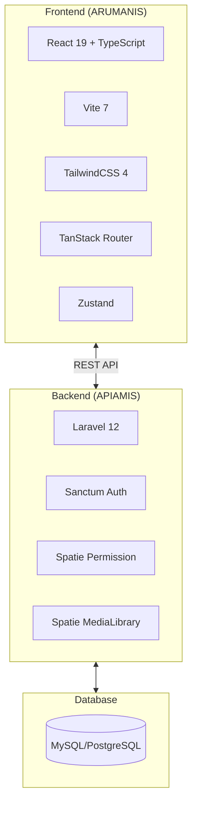

# 📚 Dokumentasi ARUMANIS

**Aplikasi Satu Data Air Minum dan Sanitasi**

Dokumentasi lengkap untuk sistem ARUMANIS yang terdiri dari backend API (APIAMIS) dan frontend aplikasi (ARUMANIS).

---

## 📖 Daftar Dokumentasi

### Backend (APIAMIS)
| Dokumen | Deskripsi |
|---------|-----------|
| [Arsitektur](./backend/ARCHITECTURE.md) | Struktur dan arsitektur backend Laravel |
| [API Reference](./backend/API_REFERENCE.md) | Dokumentasi lengkap API endpoints |
| [Database](./backend/DATABASE.md) | Skema database dan relasi tabel |
| [Instalasi](./backend/INSTALLATION.md) | Panduan instalasi dan konfigurasi |

### Frontend (ARUMANIS)
| Dokumen | Deskripsi |
|---------|-----------|
| [Arsitektur](./frontend/ARCHITECTURE.md) | Struktur dan arsitektur frontend React |
| [Komponen](./frontend/COMPONENTS.md) | Dokumentasi UI components |
| [Fitur](./frontend/FEATURES.md) | Daftar dan deskripsi fitur aplikasi |
| [Instalasi](./frontend/INSTALLATION.md) | Panduan instalasi dan konfigurasi |

---

## 🛠️ Tech Stack Overview



---

## 🚀 Quick Start

### Backend Setup
```bash
cd apiamis
composer install
cp .env.example .env
php artisan key:generate
php artisan migrate --seed
php artisan serve
```

### Frontend Setup
```bash
cd arumanis
bun install
bun run dev
```

---

## 📝 Versioning

| Komponen | Versi |
|----------|-------|
| Backend (APIAMIS) | Laravel 12 |
| Frontend (ARUMANIS) | React 19 |
| PHP | ^8.2 |
| Node.js/Bun | ^18.0 |

---

## 👥 Tim Pengembang

- **Bidang Air Minum dan Sanitasi**
- Dinas Perumahan Rakyat dan Kawasan Permukiman

---

## 📄 License

MIT License - Lihat [LICENSE](../LICENSE) untuk detail.
