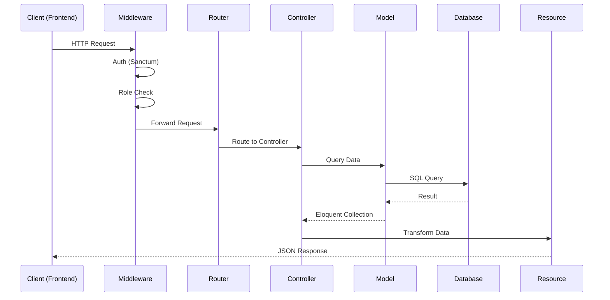

# 🏗️ Arsitektur Backend - APIAMIS

## 📋 Overview

APIAMIS adalah REST API backend untuk aplikasi ARUMANIS yang dibangun dengan Laravel 12. API ini menyediakan endpoint untuk manajemen proyek infrastruktur Air Minum dan Sanitasi.

---

## 📁 Struktur Direktori

```
apiamis/
├── app/
│   ├── Http/
│   │   ├── Controllers/       # 22 API Controllers
│   │   ├── Middleware/        # Custom middleware
│   │   └── Resources/         # API Resources untuk JSON responses
│   ├── Models/                # 17 Eloquent Models
│   └── Providers/             # Service Providers
│
├── database/
│   ├── factories/             # Model factories untuk testing
│   ├── migrations/            # Database migrations
│   └── seeders/               # Database seeders
│
├── routes/
│   ├── api.php                # API routes
│   ├── console.php            # Console commands
│   └── web.php                # Web routes
│
├── config/                    # Configuration files
├── storage/                   # File storage
└── tests/                     # PHPUnit tests
```

---

## 🧩 Komponen Utama

### Controllers

| Controller | Deskripsi |
|------------|-----------|
| `AuthController` | Autentikasi (login, logout, user info) |
| `DashboardController` | Statistik dashboard |
| `KecamatanController` | CRUD data kecamatan |
| `DesaController` | CRUD data desa |
| `PenyediaController` | CRUD data penyedia/vendor |
| `KegiatanController` | CRUD kegiatan/program |
| `PekerjaanController` | CRUD pekerjaan (16KB - controller terbesar) |
| `KontrakController` | CRUD kontrak |
| `OutputController` | CRUD output proyek |
| `PenerimaController` | CRUD penerima manfaat |
| `BerkasController` | Manajemen dokumen |
| `FotoController` | Manajemen foto dokumentasi |
| `ProgressController` | Laporan progress |
| `UserController` | Manajemen user |
| `RoleController` | Manajemen role |
| `PermissionController` | Manajemen permission |
| `RoutePermissionController` | Akses rute berdasarkan role |
| `MenuPermissionController` | Akses menu berdasarkan role |
| `KegiatanRoleController` | Relasi kegiatan dan role |
| `AppSettingController` | Pengaturan aplikasi |
| `BeritaAcaraController` | Berita acara proyek |

### Models

| Model | Tabel | Deskripsi |
|-------|-------|-----------|
| `User` | users | Data pengguna |
| `Kecamatan` | tbl_kecamatan | Data kecamatan |
| `Desa` | tbl_desa | Data desa |
| `Penyedia` | tbl_penyedia | Data penyedia/vendor |
| `Kegiatan` | tbl_kegiatan | Data kegiatan/program |
| `Pekerjaan` | tbl_pekerjaan | Data pekerjaan |
| `Kontrak` | tbl_kontrak | Data kontrak |
| `Output` | tbl_output | Data output proyek |
| `Penerima` | tbl_penerima | Data penerima manfaat |
| `Berkas` | tbl_berkas | Data dokumen |
| `Foto` | tbl_foto | Data foto |
| `Progress` | tbl_progress | Data progress |
| `BeritaAcara` | tbl_berita_acara | Data berita acara |
| `AppSetting` | app_settings | Pengaturan aplikasi |
| `KegiatanRole` | kegiatan_role | Relasi kegiatan-role |
| `RoutePermission` | route_permissions | Akses rute |
| `MenuPermission` | menu_permissions | Akses menu |

---

## 🔄 Request Flow



---

## 🔐 Authentication & Authorization

### Laravel Sanctum
- SPA Authentication dengan cookies
- Token-based authentication untuk API
- CSRF protection

### Spatie Permission
- Role-based access control (RBAC)
- Roles: `admin`, `user`, dll.
- Fine-grained permissions

### Route Protection
```php
// Protected routes
Route::middleware('auth:sanctum')->group(function () {
    // Authenticated routes
});

// Admin-only routes
Route::middleware(['auth:sanctum', 'role:admin'])->group(function () {
    // Admin routes
});
```

---

## 📦 Dependencies Utama

| Package | Versi | Fungsi |
|---------|-------|--------|
| laravel/framework | ^12.0 | Core framework |
| laravel/sanctum | ^4.0 | API authentication |
| spatie/laravel-permission | ^6.0 | Role & permission |
| spatie/laravel-medialibrary | ^11.0 | Media/file management |
| darkaonline/l5-swagger | ^8.0 | API documentation |

---

## 🗂️ Naming Conventions

### Controllers
- PascalCase dengan suffix `Controller`
- Contoh: `PekerjaanController.php`

### Models
- PascalCase singular
- Table prefix `tbl_`
- Contoh: Model `Pekerjaan` → Table `tbl_pekerjaan`

### API Resources
- PascalCase dengan suffix `Resource`
- Contoh: `PekerjaanResource.php`

### Routes
- kebab-case
- RESTful naming
- Contoh: `/api/pekerjaan`, `/api/kegiatan-role`

---

## ⚡ Performance Considerations

1. **Eager Loading**: Gunakan `with()` untuk menghindari N+1 queries
2. **Pagination**: Semua list endpoints menggunakan pagination
3. **Caching**: Cache data yang jarang berubah
4. **Query Optimization**: Gunakan indexes pada kolom yang sering di-query

---

## 🧪 Testing

```bash
# Run all tests
php artisan test

# Run specific test
php artisan test --filter=PekerjaanTest

# With coverage
php artisan test --coverage
```

---

## 📚 Related Documentation

- [API Reference](./API_REFERENCE.md)
- [Database Schema](./DATABASE.md)
- [Installation Guide](./INSTALLATION.md)
