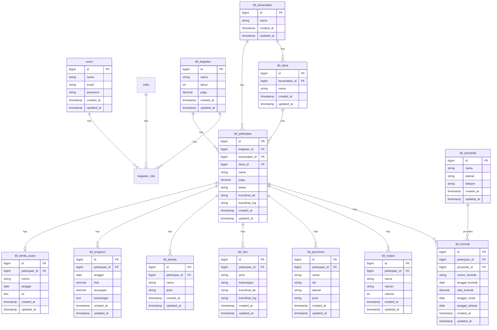

# 🗃️ Database Schema - APIAMIS

## 📋 Overview

Database menggunakan MySQL/PostgreSQL dengan konvensi penamaan tabel menggunakan prefix `tbl_`.

---

## 📊 Entity Relationship Diagram



---

## 📋 Deskripsi Tabel

### Master Data

#### `users`
Tabel pengguna sistem.

| Kolom | Tipe | Deskripsi |
|-------|------|-----------|
| id | BIGINT | Primary key |
| name | VARCHAR(255) | Nama lengkap |
| email | VARCHAR(255) | Email (unique) |
| password | VARCHAR(255) | Password (hashed) |
| created_at | TIMESTAMP | Waktu dibuat |
| updated_at | TIMESTAMP | Waktu diupdate |

#### `roles` (Spatie Permission)
Tabel role pengguna.

| Kolom | Tipe | Deskripsi |
|-------|------|-----------|
| id | BIGINT | Primary key |
| name | VARCHAR(255) | Nama role |
| guard_name | VARCHAR(255) | Guard name |
| created_at | TIMESTAMP | Waktu dibuat |
| updated_at | TIMESTAMP | Waktu diupdate |

#### `permissions` (Spatie Permission)
Tabel permission.

| Kolom | Tipe | Deskripsi |
|-------|------|-----------|
| id | BIGINT | Primary key |
| name | VARCHAR(255) | Nama permission |
| guard_name | VARCHAR(255) | Guard name |
| created_at | TIMESTAMP | Waktu dibuat |
| updated_at | TIMESTAMP | Waktu diupdate |

---

### Wilayah

#### `tbl_kecamatan`
Data kecamatan.

| Kolom | Tipe | Deskripsi |
|-------|------|-----------|
| id | BIGINT | Primary key |
| nama | VARCHAR(255) | Nama kecamatan |
| created_at | TIMESTAMP | Waktu dibuat |
| updated_at | TIMESTAMP | Waktu diupdate |

#### `tbl_desa`
Data desa/kelurahan.

| Kolom | Tipe | Deskripsi |
|-------|------|-----------|
| id | BIGINT | Primary key |
| kecamatan_id | BIGINT | FK ke tbl_kecamatan |
| nama | VARCHAR(255) | Nama desa |
| created_at | TIMESTAMP | Waktu dibuat |
| updated_at | TIMESTAMP | Waktu diupdate |

---

### Data Utama

#### `tbl_kegiatan`
Data kegiatan/program.

| Kolom | Tipe | Deskripsi |
|-------|------|-----------|
| id | BIGINT | Primary key |
| nama | VARCHAR(255) | Nama kegiatan |
| tahun | INT | Tahun anggaran |
| pagu | DECIMAL(15,2) | Nilai pagu anggaran |
| created_at | TIMESTAMP | Waktu dibuat |
| updated_at | TIMESTAMP | Waktu diupdate |

#### `tbl_penyedia`
Data penyedia/vendor.

| Kolom | Tipe | Deskripsi |
|-------|------|-----------|
| id | BIGINT | Primary key |
| nama | VARCHAR(255) | Nama penyedia |
| alamat | TEXT | Alamat |
| telepon | VARCHAR(20) | Nomor telepon |
| created_at | TIMESTAMP | Waktu dibuat |
| updated_at | TIMESTAMP | Waktu diupdate |

#### `tbl_pekerjaan`
Data pekerjaan (tabel utama).

| Kolom | Tipe | Deskripsi |
|-------|------|-----------|
| id | BIGINT | Primary key |
| kegiatan_id | BIGINT | FK ke tbl_kegiatan |
| kecamatan_id | BIGINT | FK ke tbl_kecamatan |
| desa_id | BIGINT | FK ke tbl_desa |
| nama | VARCHAR(255) | Nama pekerjaan |
| pagu | DECIMAL(15,2) | Nilai pagu |
| lokasi | TEXT | Detail lokasi |
| koordinat_lat | VARCHAR(50) | Latitude |
| koordinat_lng | VARCHAR(50) | Longitude |
| created_at | TIMESTAMP | Waktu dibuat |
| updated_at | TIMESTAMP | Waktu diupdate |

#### `tbl_kontrak`
Data kontrak pekerjaan.

| Kolom | Tipe | Deskripsi |
|-------|------|-----------|
| id | BIGINT | Primary key |
| pekerjaan_id | BIGINT | FK ke tbl_pekerjaan |
| penyedia_id | BIGINT | FK ke tbl_penyedia |
| nomor_kontrak | VARCHAR(100) | Nomor kontrak/SPK |
| tanggal_kontrak | DATE | Tanggal kontrak |
| nilai_kontrak | DECIMAL(15,2) | Nilai kontrak |
| tanggal_mulai | DATE | Tanggal mulai |
| tanggal_selesai | DATE | Tanggal selesai |
| kode_rup | VARCHAR(100) | Kode RUP |
| kode_paket | VARCHAR(100) | Kode Paket SPSE |
| created_at | TIMESTAMP | Waktu dibuat |
| updated_at | TIMESTAMP | Waktu diupdate |

---

### Data Pendukung

#### `tbl_output`
Output/hasil pekerjaan.

| Kolom | Tipe | Deskripsi |
|-------|------|-----------|
| id | BIGINT | Primary key |
| pekerjaan_id | BIGINT | FK ke tbl_pekerjaan |
| nama | VARCHAR(255) | Nama output |
| satuan | VARCHAR(50) | Satuan (SR, Unit, dll) |
| volume | INT | Volume/jumlah |
| created_at | TIMESTAMP | Waktu dibuat |
| updated_at | TIMESTAMP | Waktu diupdate |

#### `tbl_penerima`
Data penerima manfaat.

| Kolom | Tipe | Deskripsi |
|-------|------|-----------|
| id | BIGINT | Primary key |
| pekerjaan_id | BIGINT | FK ke tbl_pekerjaan |
| nama | VARCHAR(255) | Nama penerima |
| nik | VARCHAR(16) | NIK |
| alamat | TEXT | Alamat |
| jenis | VARCHAR(50) | Jenis (individual/komunal) |
| created_at | TIMESTAMP | Waktu dibuat |
| updated_at | TIMESTAMP | Waktu diupdate |

#### `tbl_foto`
Foto dokumentasi (dengan MediaLibrary).

| Kolom | Tipe | Deskripsi |
|-------|------|-----------|
| id | BIGINT | Primary key |
| pekerjaan_id | BIGINT | FK ke tbl_pekerjaan |
| jenis | VARCHAR(50) | Jenis foto (0%, 50%, 100%) |
| keterangan | TEXT | Keterangan foto |
| koordinat_lat | VARCHAR(50) | Latitude saat foto |
| koordinat_lng | VARCHAR(50) | Longitude saat foto |
| created_at | TIMESTAMP | Waktu dibuat |
| updated_at | TIMESTAMP | Waktu diupdate |

#### `tbl_berkas`
Dokumen/berkas pekerjaan (dengan MediaLibrary).

| Kolom | Tipe | Deskripsi |
|-------|------|-----------|
| id | BIGINT | Primary key |
| pekerjaan_id | BIGINT | FK ke tbl_pekerjaan |
| nama | VARCHAR(255) | Nama berkas |
| jenis | VARCHAR(50) | Jenis berkas |
| created_at | TIMESTAMP | Waktu dibuat |
| updated_at | TIMESTAMP | Waktu diupdate |

#### `tbl_progress`
Progress fisik dan keuangan.

| Kolom | Tipe | Deskripsi |
|-------|------|-----------|
| id | BIGINT | Primary key |
| pekerjaan_id | BIGINT | FK ke tbl_pekerjaan |
| tanggal | DATE | Tanggal progress |
| fisik | DECIMAL(5,2) | Progress fisik (%) |
| keuangan | DECIMAL(5,2) | Progress keuangan (%) |
| keterangan | TEXT | Keterangan |
| created_at | TIMESTAMP | Waktu dibuat |
| updated_at | TIMESTAMP | Waktu diupdate |

#### `tbl_berita_acara`
Berita acara pekerjaan.

| Kolom | Tipe | Deskripsi |
|-------|------|-----------|
| id | BIGINT | Primary key |
| pekerjaan_id | BIGINT | FK ke tbl_pekerjaan |
| nomor | VARCHAR(100) | Nomor berita acara |
| tanggal | DATE | Tanggal |
| isi | TEXT | Isi berita acara |
| created_at | TIMESTAMP | Waktu dibuat |
| updated_at | TIMESTAMP | Waktu diupdate |

---

### Tabel Pendukung

#### `kegiatan_role`
Relasi kegiatan dan role (untuk filtering pekerjaan).

| Kolom | Tipe | Deskripsi |
|-------|------|-----------|
| id | BIGINT | Primary key |
| kegiatan_id | BIGINT | FK ke tbl_kegiatan |
| role_id | BIGINT | FK ke roles |
| created_at | TIMESTAMP | Waktu dibuat |
| updated_at | TIMESTAMP | Waktu diupdate |

#### `route_permissions`
Akses route berdasarkan role.

| Kolom | Tipe | Deskripsi |
|-------|------|-----------|
| id | BIGINT | Primary key |
| route_pattern | VARCHAR(255) | Pattern route |
| method | VARCHAR(10) | HTTP method |
| permission_id | BIGINT | FK ke permissions |
| created_at | TIMESTAMP | Waktu dibuat |
| updated_at | TIMESTAMP | Waktu diupdate |

#### `menu_permissions`
Akses menu berdasarkan role.

| Kolom | Tipe | Deskripsi |
|-------|------|-----------|
| id | BIGINT | Primary key |
| menu_key | VARCHAR(100) | Key menu |
| menu_label | VARCHAR(255) | Label menu |
| menu_path | VARCHAR(255) | Path menu |
| icon | VARCHAR(100) | Icon menu |
| parent_id | BIGINT | FK ke menu_permissions |
| order | INT | Urutan menu |
| permission_id | BIGINT | FK ke permissions |
| created_at | TIMESTAMP | Waktu dibuat |
| updated_at | TIMESTAMP | Waktu diupdate |

#### `app_settings`
Pengaturan aplikasi.

| Kolom | Tipe | Deskripsi |
|-------|------|-----------|
| id | BIGINT | Primary key |
| key | VARCHAR(100) | Key setting |
| value | TEXT | Value setting |
| created_at | TIMESTAMP | Waktu dibuat |
| updated_at | TIMESTAMP | Waktu diupdate |

---

## 🔧 Indexes

### Primary Keys
Semua tabel memiliki primary key `id` dengan auto-increment.

### Foreign Keys
```sql
-- tbl_desa
ALTER TABLE tbl_desa ADD FOREIGN KEY (kecamatan_id) REFERENCES tbl_kecamatan(id);

-- tbl_pekerjaan
ALTER TABLE tbl_pekerjaan ADD FOREIGN KEY (kegiatan_id) REFERENCES tbl_kegiatan(id);
ALTER TABLE tbl_pekerjaan ADD FOREIGN KEY (kecamatan_id) REFERENCES tbl_kecamatan(id);
ALTER TABLE tbl_pekerjaan ADD FOREIGN KEY (desa_id) REFERENCES tbl_desa(id);

-- tbl_kontrak
ALTER TABLE tbl_kontrak ADD FOREIGN KEY (pekerjaan_id) REFERENCES tbl_pekerjaan(id);
ALTER TABLE tbl_kontrak ADD FOREIGN KEY (penyedia_id) REFERENCES tbl_penyedia(id);

-- dan seterusnya...
```

### Recommended Indexes
```sql
-- Untuk filtering
CREATE INDEX idx_pekerjaan_kegiatan ON tbl_pekerjaan(kegiatan_id);
CREATE INDEX idx_pekerjaan_kecamatan ON tbl_pekerjaan(kecamatan_id);
CREATE INDEX idx_pekerjaan_desa ON tbl_pekerjaan(desa_id);
CREATE INDEX idx_desa_kecamatan ON tbl_desa(kecamatan_id);
CREATE INDEX idx_kegiatan_tahun ON tbl_kegiatan(tahun);
```

---

## 📚 Related Documentation

- [Architecture](./ARCHITECTURE.md)
- [API Reference](./API_REFERENCE.md)
- [Installation Guide](./INSTALLATION.md)
