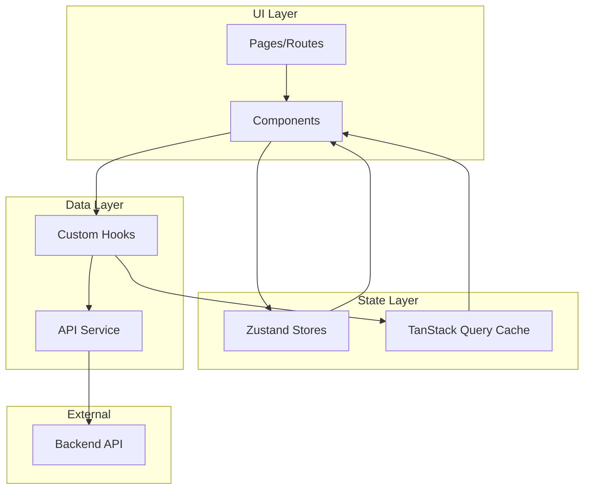

# 🏗️ Arsitektur Frontend - ARUMANIS

## 📋 Overview

ARUMANIS adalah aplikasi frontend React yang dibangun dengan Vite dan TypeScript. Aplikasi ini menggunakan arsitektur feature-based untuk memudahkan pengembangan dan maintenance.

---

## 📁 Struktur Direktori

```
src/
├── components/           # Reusable UI components
│   ├── layout/          # Layout components
│   │   ├── Sidebar.tsx
│   │   ├── Header.tsx
│   │   └── MainLayout.tsx
│   └── ui/              # Base UI components (shadcn/ui)
│       ├── button.tsx
│       ├── card.tsx
│       ├── dialog.tsx
│       ├── form.tsx
│       ├── input.tsx
│       ├── select.tsx
│       ├── table.tsx
│       └── ...
│
├── config/              # App configuration
│   ├── abilities.ts     # CASL ability definitions
│   └── theme.ts         # Theme configuration
│
├── context/             # React contexts
│   ├── AuthContext.tsx
│   └── ThemeContext.tsx
│
├── features/            # Feature-based modules (20 modules)
│   ├── auth/
│   ├── berkas/
│   ├── chat/
│   ├── dashboard/
│   ├── desa/
│   ├── foto/
│   ├── kecamatan/
│   ├── kegiatan/
│   ├── kegiatan-role/
│   ├── kontrak/
│   ├── menu-permissions/
│   ├── output/
│   ├── pekerjaan/       # Feature terbesar (18 files)
│   ├── penerima/
│   ├── permissions/
│   ├── progress/
│   ├── roles/
│   ├── route-permissions/
│   ├── settings/
│   └── users/
│
├── hooks/               # Custom React hooks
│   ├── useAuth.ts
│   ├── useApi.ts
│   └── ...
│
├── lib/                 # Utility libraries
│   ├── api.ts           # Axios instance
│   ├── utils.ts         # Helper functions
│   └── ...
│
├── routes/              # TanStack Router definitions
│   ├── __root.tsx
│   ├── index.tsx
│   └── ...
│
└── stores/              # Zustand stores
    ├── authStore.ts
    ├── settingsStore.ts
    └── ...
```

---

## 🧩 Feature Module Structure

Setiap feature module mengikuti struktur yang konsisten:

```
features/{feature-name}/
├── components/          # Feature-specific components
│   ├── FeatureList.tsx
│   ├── FeatureForm.tsx
│   └── FeatureDetail.tsx
├── hooks/               # Feature-specific hooks
│   └── useFeature.ts
├── types/               # TypeScript types
│   └── index.ts
└── index.ts             # Module exports
```

### Contoh: Feature Pekerjaan

```
features/pekerjaan/
├── components/
│   ├── PekerjaanList.tsx
│   ├── PekerjaanForm.tsx
│   ├── PekerjaanDetail.tsx
│   ├── ProgressTabContent.tsx
│   ├── KontrakTabContent.tsx
│   ├── OutputTabContent.tsx
│   ├── PenerimaTabContent.tsx
│   ├── FotoTabContent.tsx
│   ├── BerkasTabContent.tsx
│   └── ...
├── hooks/
│   └── usePekerjaan.ts
├── types/
│   └── index.ts
└── index.ts
```

---

## 🔄 Data Flow



---

## 🎨 Component Architecture

### UI Components (shadcn/ui)
Komponen dasar yang dapat digunakan ulang di seluruh aplikasi.

```tsx
// src/components/ui/button.tsx
import { cn } from "@/lib/utils"

interface ButtonProps {
  variant?: 'default' | 'destructive' | 'outline' | 'ghost'
  size?: 'default' | 'sm' | 'lg'
  children: React.ReactNode
}

export function Button({ variant, size, children, ...props }: ButtonProps) {
  return (
    <button className={cn(buttonVariants({ variant, size }))} {...props}>
      {children}
    </button>
  )
}
```

### Feature Components
Komponen khusus untuk fitur tertentu.

```tsx
// src/features/pekerjaan/components/PekerjaanList.tsx
import { usePekerjaan } from '../hooks/usePekerjaan'
import { DataTable } from '@/components/ui/data-table'

export function PekerjaanList() {
  const { data, isLoading } = usePekerjaan()
  
  if (isLoading) return <Loading />
  
  return <DataTable data={data} columns={columns} />
}
```

### Layout Components
Komponen untuk struktur layout aplikasi.

```tsx
// src/components/layout/MainLayout.tsx
import { Sidebar } from './Sidebar'
import { Header } from './Header'

export function MainLayout({ children }: { children: React.ReactNode }) {
  return (
    <div className="flex h-screen">
      <Sidebar />
      <div className="flex-1 flex flex-col">
        <Header />
        <main className="flex-1 overflow-auto p-6">
          {children}
        </main>
      </div>
    </div>
  )
}
```

---

## 🗂️ State Management

### Zustand Store

```tsx
// src/stores/authStore.ts
import { create } from 'zustand'

interface AuthState {
  user: User | null
  isAuthenticated: boolean
  login: (credentials: Credentials) => Promise<void>
  logout: () => void
}

export const useAuthStore = create<AuthState>((set) => ({
  user: null,
  isAuthenticated: false,
  
  login: async (credentials) => {
    const user = await authApi.login(credentials)
    set({ user, isAuthenticated: true })
  },
  
  logout: () => {
    set({ user: null, isAuthenticated: false })
  }
}))
```

### TanStack Query

```tsx
// src/features/pekerjaan/hooks/usePekerjaan.ts
import { useQuery, useMutation, useQueryClient } from '@tanstack/react-query'
import { pekerjaanApi } from '@/lib/api'

export function usePekerjaan() {
  return useQuery({
    queryKey: ['pekerjaan'],
    queryFn: () => pekerjaanApi.getAll()
  })
}

export function useCreatePekerjaan() {
  const queryClient = useQueryClient()
  
  return useMutation({
    mutationFn: pekerjaanApi.create,
    onSuccess: () => {
      queryClient.invalidateQueries({ queryKey: ['pekerjaan'] })
    }
  })
}
```

---

## 🛣️ Routing

### TanStack Router

```tsx
// src/routes/__root.tsx
import { createRootRoute, Outlet } from '@tanstack/react-router'
import { MainLayout } from '@/components/layout/MainLayout'

export const Route = createRootRoute({
  component: () => (
    <MainLayout>
      <Outlet />
    </MainLayout>
  )
})

// src/routes/pekerjaan/$pekerjaanId.tsx
import { createFileRoute } from '@tanstack/react-router'
import { PekerjaanDetail } from '@/features/pekerjaan'

export const Route = createFileRoute('/pekerjaan/$pekerjaanId')({
  component: PekerjaanDetail,
  loader: async ({ params }) => {
    return pekerjaanApi.getById(params.pekerjaanId)
  }
})
```

---

## 🔐 Authorization

### CASL Abilities

```tsx
// src/config/abilities.ts
import { defineAbility } from '@casl/ability'

export function defineAbilitiesFor(user: User) {
  return defineAbility((can, cannot) => {
    if (user.role === 'admin') {
      can('manage', 'all')
    } else {
      can('read', 'Pekerjaan')
      can('update', 'Pekerjaan', { userId: user.id })
      cannot('delete', 'Pekerjaan')
    }
  })
}
```

### Usage in Components

```tsx
import { Can } from '@casl/react'
import { useAbility } from '@/hooks/useAbility'

function PekerjaanActions({ pekerjaan }: { pekerjaan: Pekerjaan }) {
  const ability = useAbility()
  
  return (
    <div>
      <Can I="update" a="Pekerjaan" ability={ability}>
        <Button>Edit</Button>
      </Can>
      
      <Can I="delete" a="Pekerjaan" ability={ability}>
        <Button variant="destructive">Delete</Button>
      </Can>
    </div>
  )
}
```

---

## 📝 Form Handling

### React Hook Form + Zod

```tsx
// src/features/pekerjaan/components/PekerjaanForm.tsx
import { useForm } from 'react-hook-form'
import { zodResolver } from '@hookform/resolvers/zod'
import { z } from 'zod'

const schema = z.object({
  nama: z.string().min(3, 'Nama minimal 3 karakter'),
  kegiatan_id: z.number(),
  kecamatan_id: z.number(),
  desa_id: z.number(),
  pagu: z.number().positive('Pagu harus lebih dari 0')
})

type FormValues = z.infer<typeof schema>

export function PekerjaanForm() {
  const form = useForm<FormValues>({
    resolver: zodResolver(schema)
  })
  
  const onSubmit = (data: FormValues) => {
    // Submit data
  }
  
  return (
    <form onSubmit={form.handleSubmit(onSubmit)}>
      {/* Form fields */}
    </form>
  )
}
```

---

## 🎨 Styling

### Tailwind CSS 4

```tsx
// Component dengan Tailwind classes
<div className="flex items-center gap-4 p-6 bg-card rounded-lg shadow-sm border">
  <h2 className="text-xl font-semibold text-foreground">
    {title}
  </h2>
  <p className="text-muted-foreground">
    {description}
  </p>
</div>
```

### Dark Mode Support

```tsx
// Menggunakan dark: prefix
<div className="bg-white dark:bg-gray-900">
  <h1 className="text-gray-900 dark:text-gray-100">
    Content
  </h1>
</div>
```

---

## 📤 Export Features

### PDF Export (jsPDF + html2canvas)

```tsx
import jsPDF from 'jspdf'
import html2canvas from 'html2canvas'

export async function exportToPDF(elementId: string, filename: string) {
  const element = document.getElementById(elementId)
  if (!element) return
  
  const canvas = await html2canvas(element)
  const imgData = canvas.toDataURL('image/png')
  
  const pdf = new jsPDF('p', 'mm', 'a4')
  const imgWidth = 210
  const imgHeight = (canvas.height * imgWidth) / canvas.width
  
  pdf.addImage(imgData, 'PNG', 0, 0, imgWidth, imgHeight)
  pdf.save(`${filename}.pdf`)
}
```

---

## 📚 Related Documentation

- [Components](./COMPONENTS.md)
- [Features](./FEATURES.md)
- [Installation Guide](./INSTALLATION.md)
